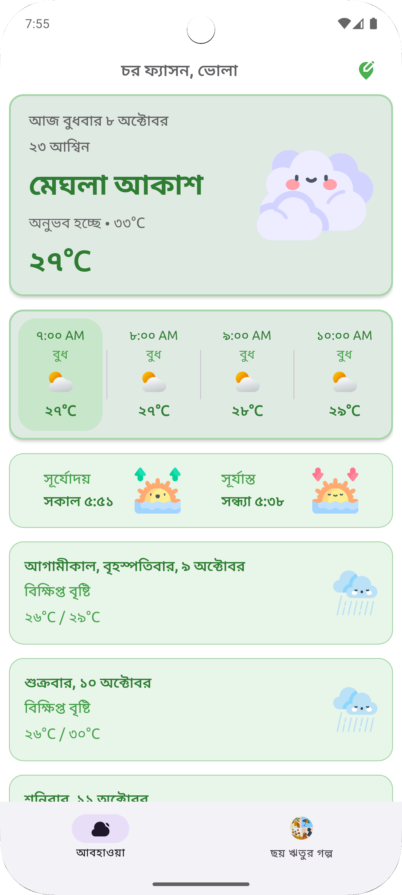
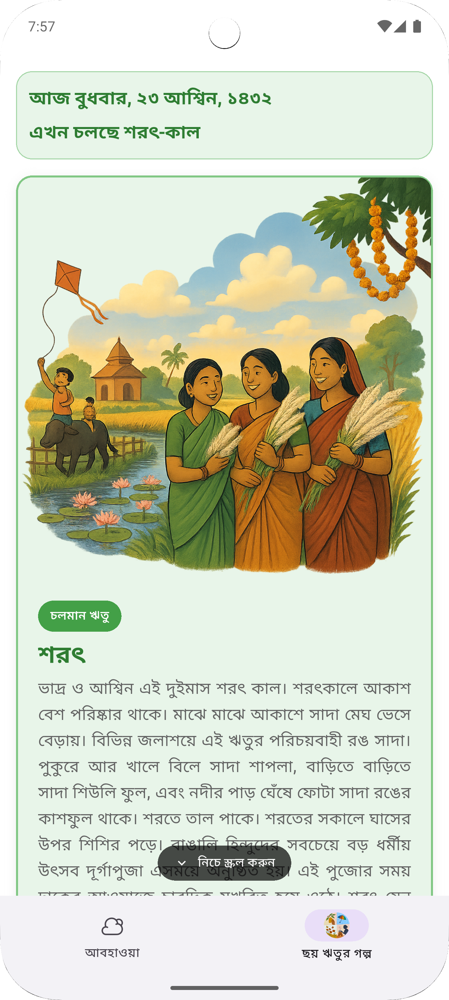

# Bangla Weather: Accessible Weather Information for Disaster-Prone Coastal Communities

**Md Moniruzzaman** | Independent Project (2023–2025) 

[](https://play.google.com/store/apps/details?id=com.tech_with_m.choy_ritur_golpo)
[](https://flutter.dev/)
[](LICENSE)

---

## 🌟 Overview

Bangla Weather is a mobile application designed to provide accessible weather information for disaster-prone coastal communities in Bangladesh. Built with Flutter, this app prioritizes simplicity, cultural appropriateness, and offline functionality to serve marginalized communities facing annual cyclones and extreme weather events.

### Key Features

- **🌤️ Weather Data**: Current conditions and forecasts for Bangladesh
- **🇧🇩 Bangla Language Interface**: UI primarily in Bengali for local accessibility
- **📱 Offline-First Design**: Works without internet connection using cached data
- **🚨 Disaster Alerts**: Push notifications for weather warnings and emergencies
- **🌸 Cultural Seasons Tab**: Information about Bangladesh's six seasons with traditional context

---

## 🎯 Research Background

### Problem Statement

Bangladesh ranks among the world's most climate-vulnerable nations. The 2023 Cyclone Mocha affected over 1.5 million people, yet existing weather apps fail coastal communities. During field visits, I observed that despite widespread smartphone ownership, residents struggled with English-language apps using technical terminology like "precipitation probability"—meaningless to farmers and fishermen whose livelihoods depend on weather conditions.

### Participatory Design Approach

Before development, I consulted 12 professionals (2023 - 2025): disaster management officials, first responders, and local technology practitioners. Key insights revealed:

- **Trust matters more than accuracy**: Local figures are trusted over government apps
- **Language barriers exclude users**: Technical terms and English interfaces prevent access
- **Connectivity fails when needed most**: Mobile signals disappear during storms

### Impact

- **Positive user reception** with high ratings on Play Store
- **Active usage** across Bangladesh and neighboring regions
- **Community adoption** demonstrating need for Bangla-language weather tools

---

## 🚀 Getting Started

### Prerequisites

Before you begin, ensure you have the following installed:

- **Flutter SDK** (3.7.2 or later) - [Install Flutter](https://flutter.dev/docs/get-started/install)
- **Android Studio** or **VS Code** with Flutter extensions
- **Git** for version control
- **Android device** or **emulator** for testing

### Installation Guide

#### Step 1: Clone the Repository

```bash
git clone https://github.com/tech-with-m/choy-ritur-golpo.git
cd choy-ritur-golpo
```

#### Step 2: Install Dependencies

```bash
flutter pub get
```

#### Step 3: Firebase Setup (Required for Push Notifications)

1. **Create a Firebase Project**:
   - Go to [Firebase Console](https://console.firebase.google.com/)
   - Click "Create a project" and follow the setup wizard
   - Enable Google Analytics (optional)

2. **Add Android App**:
   - Click "Add app" and select Android
   - Use package name: `com.tech_with_m.choy_ritur_golpo`
   - Download `google-services.json`
   - Place the file in `android/app/` directory

3. **Enable Services**:
   - Go to Project Settings → Cloud Messaging
   - Enable Cloud Messaging
   - Note down your Server Key (for sending notifications)

#### Step 4: Configure App Signing (For Release Builds)

1. **Create a keystore** (if you don't have one):
   ```bash
   keytool -genkey -v -keystore android/app/choy_ritur_golpo.keystore -keyalg RSA -keysize 2048 -validity 10000 -alias choy_ritur_golpo
   ```

2. **Create key.properties file**:
   Create `android/key.properties` with your keystore details:
   ```properties
   storePassword=your_store_password
   keyPassword=your_key_password
   keyAlias=choy_ritur_golpo
   storeFile=choy_ritur_golpo.keystore
   ```

#### Step 5: Run the App

```bash
# For debug mode
flutter run

# For release mode (requires keystore setup)
flutter run --release
```

### 🛠️ Development Setup for Beginners

#### If you're new to Flutter:

1. **Install Flutter**:
   - Download from [flutter.dev](https://flutter.dev/docs/get-started/install)
   - Add Flutter to your PATH
   - Run `flutter doctor` to check installation

2. **Install Android Studio**:
   - Download from [developer.android.com](https://developer.android.com/studio)
   - Install Android SDK and emulator
   - Install Flutter and Dart plugins

3. **Verify Setup**:
   ```bash
   flutter doctor
   ```
   Ensure all checkmarks are green.

#### Common Issues and Solutions:

- **"Flutter command not found"**: Add Flutter to your system PATH
- **"No connected devices"**: Start an Android emulator or connect a physical device
- **"Gradle build failed"**: Clean and rebuild: `flutter clean && flutter pub get`

---

## 📱 App Features

### Weather Information
- Current weather conditions
- 7-day weather forecast
- Hourly weather updates
- Weather alerts and warnings
- Offline weather data access

### Cultural Integration
- **Six Seasons of Bangladesh**: Detailed information about each season
- **Traditional Practices**: Cultural context for weather patterns
- **Local Festivals**: Seasonal celebrations and traditions

### Accessibility Features
- **Large Text and Icons**: Easy to read for all users
- **Simple Language**: Avoids technical jargon
- **Offline Functionality**: Works without internet connection

### Push Notifications
- Weather alerts and warnings
- Disaster notifications
- General weather updates
- Customizable notification preferences

## 📸 App Screenshots

<div align="center">
  
  
</div>

*Left: Main weather interface showing current conditions and forecasts*  
*Right: Cultural seasons tab with information about Bangladesh's six seasons*

---

## 🔧 Technical Architecture

### Tech Stack
- **Frontend**: Flutter (Dart)
- **Backend**: Firebase (Cloud Messaging, Firestore)
- **Weather Data**: OpenMeteo API, Bangladesh Meteorological Department
- **Local Storage**: Hive database for offline caching
- **Maps**: Flutter Map with OpenStreetMap tiles

### Key Dependencies
```yaml
dependencies:
  flutter: sdk
  firebase_core: ^2.32.0
  firebase_messaging: ^14.7.10
  geolocator: ^14.0.0
  hive: ^2.2.3
  dio: ^5.8.0+1
  flutter_map: ^8.1.1
  # ... and more
```

### Project Structure
```
lib/
├── app/                    # Main application code
│   ├── ui/                # User interface components
│   ├── controllers/       # Business logic controllers
│   └── services/          # External service integrations
├── translation/           # Localization files
└── theme/                 # App theming
```

---

## 🔔 Push Notifications Setup

### Topic Subscriptions
The app automatically subscribes users to these topics:
- `general` — General weather updates
- `alert` — Weather alerts and warnings
- `news` — Weather news and information

### Sending Notifications

#### Example: Weather Alert
```bash
curl -X POST -H "Authorization: key=YOUR_SERVER_KEY" \
     -H "Content-Type: application/json" \
     -d '{
       "to": "/topics/alert",
       "notification": {
         "title": "ঝড়ের সতর্কতা",
         "body": "আপনার এলাকায় প্রবল ঝড়ের সম্ভাবনা।"
       },
       "data": {
         "alert_type": "severe"
       }
     }' \
     https://fcm.googleapis.com/fcm/send
```

#### Alert Types
- `severe`: Highest urgency (red, max importance)
- `warning`: High urgency (orange)
- `alert`: Medium urgency (amber)
- Default: Normal priority (blue)

---

## 🎨 Customization

### Adding New Weather Conditions
Edit `lib/translation/bn_in.dart` to add new weather descriptions:

```dart
'new_weather_condition': 'আপনার নতুন আবহাওয়ার বর্ণনা',
```

### Modifying UI Colors
Update `lib/theme/` files to change app colors and styling.

### Adding New Locations
Update `assets/geo/geo_with_lat_lon.json` with new location data.

---

## 🧪 Testing

### Running Tests
```bash
# Unit tests
flutter test

# Integration tests
flutter test integration_test/
```

### Testing Push Notifications
1. Install the app on a physical device
2. Use Firebase Console to send test notifications
3. Verify notifications appear correctly

---

## 📦 Building for Production

### Debug Build
```bash
flutter build apk --debug
```

### Release Build
```bash
flutter build apk --release
```

### App Bundle (for Play Store)
```bash
flutter build appbundle --release
```

---

## 🤝 Contributing

We welcome contributions! Here's how you can help:

### How to Contribute
1. Fork the repository
2. Create a feature branch: `git checkout -b feature/amazing-feature`
3. Commit your changes: `git commit -m 'Add amazing feature'`
4. Push to the branch: `git push origin feature/amazing-feature`
5. Open a Pull Request

### Areas for Contribution
- **Translation**: Add support for more languages
- **UI/UX**: Improve accessibility and user experience
- **Features**: Add new weather-related functionality
- **Documentation**: Improve setup guides and code comments
- **Testing**: Add more comprehensive test coverage

### Code Style
- Follow Flutter/Dart style guidelines
- Use meaningful variable and function names
- Add comments for complex logic
- Ensure all tests pass before submitting

---

## 📄 License

This project is licensed under the MIT License - see the [LICENSE](LICENSE) file for details.

---

## 🙏 Acknowledgments

- **OpenMeteo** for weather data API
- **Bangladesh Meteorological Department** for local weather information
- **Flutter Community** for excellent documentation and packages
- **Beta Testers** from coastal communities in Bangladesh
- **Local Technology Practitioners** who provided valuable feedback

---

## 📞 Support

- **Issues**: [GitHub Issues](https://github.com/tech-with-m/choy-ritur-golpo/issues)
- **Discussions**: [GitHub Discussions](https://github.com/tech-with-m/choy-ritur-golpo/discussions)

---

## 🔗 Links

- [Play Store](https://play.google.com/store/apps/details?id=com.tech_with_m.choy_ritur_golpo)
- [Research Paper/Portfolio](link-to-research-document)
- [Flutter Documentation](https://flutter.dev/docs)

---

**Made with ❤️ for the people of Bangladesh and coastal communities worldwide.**
